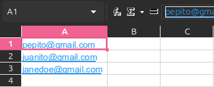

# SpamGenerator

Proyecto para la asignatura de programación consistente en en un generador de correos masivos (simulando spam) utilizando Nodemailer, Node.js, Express.js, HTML y CSS.

## Capacidades:

- Configurar y guardar los detalles del correo (remitente, destinatario, asunto, mensaje) en un archivo JSON.
- Seleccionar la cantidad de correos a enviar (de 1 a 10).
- Enviar correos masivos utilizando Nodemailer con Node.js y Express.js.
- Importar una lista de correos en formato XLSX para enviar correos a varios destinatarios.

## Mejoras pendientes:

- Guardado de logs en txt
- Control de errores en la lógica
- Regex check de correos
- Gestión de prefabs de Spam

## Tecnologías Utilizadas:

### Backend:
- Node.js
- Express.js
- Nodemailer
- XLSX(Node)

### Frontend:
- HTML5
- CSS3

### Almacenamiento:
- JSON (A traves de File-System)

## Instalación y Ejecución:

### Clonar el repositorio:

```
git clone https://github.com/SpookyyMoon/spamGenerator.git
cd SpamGenerator
```

### Instalar dependencias:

```
npm install nodemailer
npm install express
```

### Configurar el transport en servidor.js en función del proveedor empleado:

```
host: "",
port: ,
auth: {
    user: "",
    pass: ""
}
```

### Iniciar el servidor:

```
node ./servidor.js
```

### Abrir en el navegador:

Ir a http://localhost:3000 o hacer Control + click izquierdo en el enlace de la terminal.

### XLSX con lista de correos:

Debe usarse un excel plano conteniendo los correos en orden descendiente en la primera columna y desde la primera celda.

